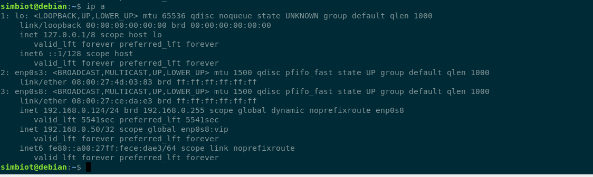

# Домашнее задание к занятию "`10.1. Keepalived/vrrp`" - `Машалов Виктор`
### Задание 1
```
первая нода
vrrp_instance testik1 {
state MASTER
interface enp0s8
virtual_router_id 10
priority 110
advert_int 4
authentication {
auth_type AH
auth_pass 1111
}
unicast_peer {
192.168.0.124
}
virtual_ipaddress {
192.168.0.50 dev enp0s8 label enp0s8:vip
}
}
```

- - - 

```
вторая нода 
1 lvl
vrrp_instance testik2 {
state BACKUP
interface enp0s8
virtual_router_id 10
priority 110
advert_int 4
authentication {
auth_type AH
auth_pass 1111
}
unicast_peer {
192.168.0.123
}
virtual_ipaddress {
192.168.0.50 dev enp0s8 label enp0s8:vip
}
}
```



---